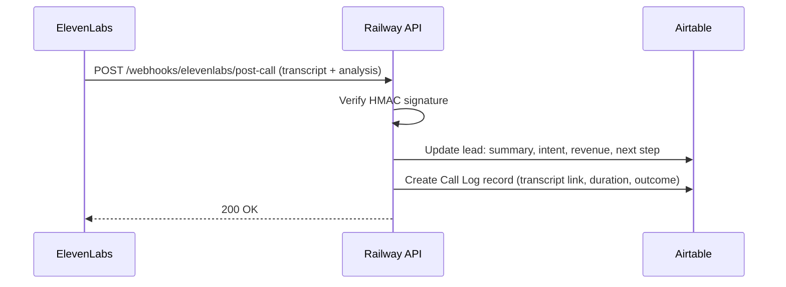

# Scribe — Post-Call Notes Automation

Scribe is not a conversational agent — it's the automation that turns every finished call into structured data in Airtable. No transcript should ever live only in the ElevenLabs dashboard.

Back to [[00 - ElevenLabs Agents Overview]] · Flow details in [[10 - Automations & Webhooks]].

## Flow

## What Scribe writes per call

**On the lead record (`Acquisition Leads`):**
- `Last Called At` — call timestamp
- `Call Status` — completed / no-answer / voicemail / declined
- `Seller Intent` — selling_now / open / not_interested / unknown
- `Qualification Summary` — 2–4 sentence LLM summary from ElevenLabs call analysis
- `Revenue Range`, `Timeline`, `Reason for Selling` — when captured
- `Next Step` — e.g. "Follow-up booked 8/3 2pm"

**New record in a `Call Logs` table** (to be created — see [[20 - Architecture & Integration]]):
- Link to lead, conversation ID, duration, full transcript (or transcript URL), evaluation results, audio recording URL.

## Implementation notes

- Source of data: ElevenLabs **post-call webhook** — fires after each conversation with transcript, analysis (summary + evaluation criteria results), and metadata. Configure per-agent in the dashboard; set the shared secret as `ELEVENLABS_WEBHOOK_SECRET` on Railway.
- Verify the `ElevenLabs-Signature` HMAC header before trusting the payload.
- Idempotency: key writes on `conversation_id` so webhook retries don't duplicate Call Log records.
- Failure handling: if the Airtable write fails, return 500 so ElevenLabs retries; log payload to console for manual replay.
