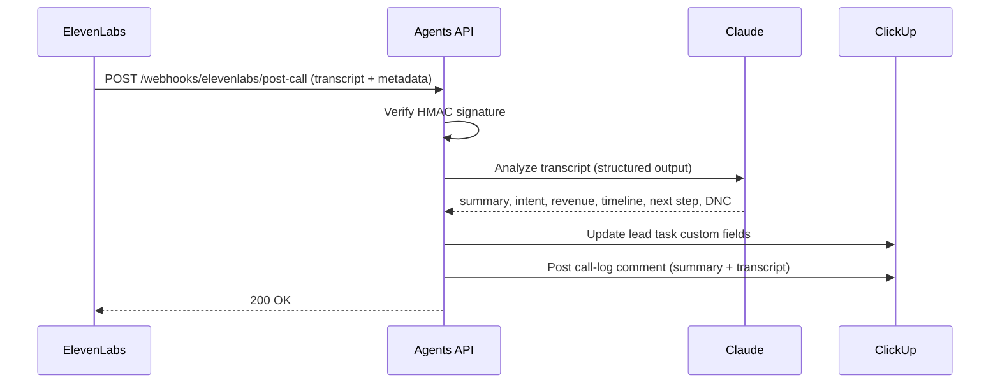

# Scribe — Post-Call Notes Automation

Scribe is not a conversational agent — it's the automation that turns every finished call into structured data in ClickUp, with **Claude doing the analysis**. No transcript should ever live only in the ElevenLabs dashboard.

Back to [[00 - ElevenLabs Agents Overview]] · Flow details in [[10 - Automations & Webhooks]].

## Flow

## What Scribe writes per call

**Custom fields on the lead task:**
- `Last Called At`, `Call Status` (completed)
- `Seller Intent` — selling_now / open / not_interested / unknown
- `Revenue Range`, `Timeline`, `Reason for Selling`, `Next Step` — when Claude extracts them
- `DNC` — checked automatically if the lead asked not to be contacted again

**Comment on the lead task** (the call log):
- Conversation ID (doubles as the idempotency key), agent role, duration
- Claude's 2–4 sentence summary
- Full transcript

## Why Claude, not just ElevenLabs' built-in analysis

ElevenLabs returns a transcript summary, but Claude (`src/claude.js`) extracts **structured, schema-validated** qualification data (`seller_intent` as a strict enum, DNC detection, next steps) using JSON-schema structured outputs on `claude-opus-5`, with Anthropic's server-side refusal fallback enabled so a declined request automatically retries on a fallback model. If the Claude call fails or `ANTHROPIC_API_KEY` isn't set, the webhook falls back to ElevenLabs' own summary so no call is ever dropped.

## Implementation notes

- Source of data: ElevenLabs **post-call webhook** — fires after each conversation with transcript and metadata. Configure per-agent in the dashboard; set the shared secret as `ELEVENLABS_WEBHOOK_SECRET`.
- Verify the `ElevenLabs-Signature` HMAC header before trusting the payload (implemented in `src/elevenlabs.js`).
- Idempotency: the call-log comment carries the `conversation_id`; retried webhooks are skipped if a comment with that ID already exists.
- Failure handling: if the ClickUp write fails, return 500 so ElevenLabs retries; payload is logged for manual replay.
