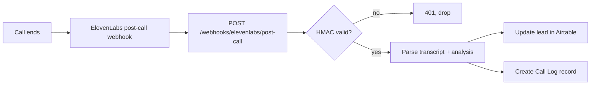
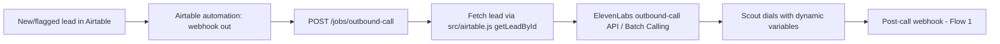

# Automations & Webhooks

The glue between ElevenLabs, the Railway API, and Airtable. Two core flows plus the tool endpoints Scout needs. Back to [[00 - ElevenLabs Agents Overview]].

## Flow 1 — Post-call webhook (inbound from ElevenLabs)

ElevenLabs fires a webhook after every conversation. This is how [[02 - Agent - Scribe (Post-Call Notes)]] works.

**New endpoint:** `POST /webhooks/elevenlabs/post-call` in `server.js`
- Verify `ElevenLabs-Signature` header (HMAC-SHA256 with `ELEVENLABS_WEBHOOK_SECRET`).
- Payload includes: `conversation_id`, `agent_id`, transcript turns, `analysis` (summary + evaluation criteria results), dynamic variables (so `lead_id` comes back for free).
- Idempotent on `conversation_id`.
- Config: ElevenLabs dashboard → agent → Workspace settings → Post-call webhook.

## Flow 2 — New-lead outbound trigger

When a new lead lands in Airtable (or is flagged "ready to call"), Scout calls it.

**New endpoint:** `POST /jobs/outbound-call` — body `{ lead_id }`
- Reuses `getLeadById` from `src/airtable.js` (after the Phase 0 fix — see [[20 - Architecture & Integration]]).
- Calls ElevenLabs outbound call API (single call) or queues into a Batch Calling job (Sentry-style sweeps — [[03 - Agent - Sentry (Follow-up & Reminders)]]).
- Passes dynamic variables: `lead_id`, `business_name`, `owner_name`, `industry`.
- Guard rails: skip if `Call Status = completed` recently, respect DNC flag, calling-hours window.

## Tool endpoints for Scout

Defined as "webhook tools" in the ElevenLabs agent config — see [[01 - Agent - Scout (Lead Qualification)]].

| Endpoint | Status | Purpose |
|---|---|---|
| `POST /agent/scout` | exists (`server.js`) | Lead lookup by `lead_id` |
| `PATCH /agent/scout/lead` | new | Update qualification fields during/after call |
| `POST /agent/scout/followup` | new | Book a follow-up (write to Airtable; later: calendar) |

All tool endpoints should require a shared bearer token (`AGENT_TOOLS_TOKEN`) since they'll be public on Railway.

## Env vars (Railway)

See [[30 - Setup Checklist & Credentials]] for the full list: `ELEVENLABS_API_KEY`, `ELEVENLABS_AGENT_ID_SCOUT`, `ELEVENLABS_WEBHOOK_SECRET`, `AGENT_TOOLS_TOKEN`, plus existing `AIRTABLE_API_KEY` / `AIRTABLE_BASE_ID`.
