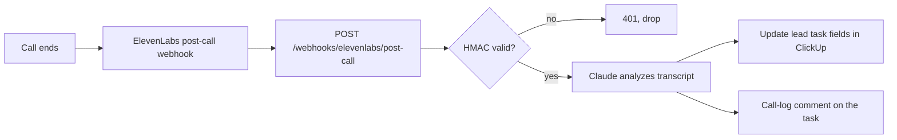
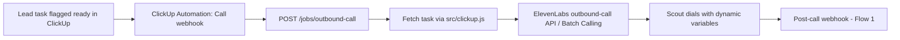

# Automations & Webhooks

The glue between ElevenLabs, the agents API, Claude, and ClickUp. Two core flows plus the tool endpoints Scout needs. Back to [[00 - ElevenLabs Agents Overview]].

## Flow 1 — Post-call webhook (inbound from ElevenLabs)

ElevenLabs fires a webhook after every conversation. This is how [[02 - Agent - Scribe (Post-Call Notes)]] works.

**Endpoint (live):** `POST /webhooks/elevenlabs/post-call` in `server.js`
- Verifies `ElevenLabs-Signature` (HMAC-SHA256 with `ELEVENLABS_WEBHOOK_SECRET`).
- Payload includes `conversation_id`, transcript turns, metadata, and dynamic variables — so `lead_id` (the ClickUp task ID) comes back for free.
- Claude (`src/claude.js`) extracts summary, seller intent, revenue range, timeline, next step, and DNC; falls back to ElevenLabs' own summary if unavailable.
- Idempotent per `conversation_id` (checked against existing task comments).
- Config: ElevenLabs dashboard → Workspace settings → Post-call webhook.

## Flow 2 — New-lead outbound trigger

When a lead task in ClickUp is ready to call, Scout calls it.

**Endpoint (live):** `POST /jobs/outbound-call` — body `{ lead_id }` (ClickUp task ID)
- Guard rails: rejects DNC-flagged leads and tasks with no phone number; sets `Call Status = queued`.
- Passes dynamic variables: `lead_id`, `business_name`, `owner_name`, `industry`.
- **ClickUp side:** create an Automation on the leads list — *"when status changes to Ready to Call → Call webhook"* pointing at this endpoint with the bearer token header.

**Endpoint (live):** `POST /jobs/sentry-sweep` — body `{ stale_days? }` (default 14)
- Finds open, non-DNC leads not called in N days and submits one ElevenLabs Batch Calling job. See [[03 - Agent - Sentry (Follow-up & Reminders)]].
- Invoke on a schedule: host cron, a GitHub Actions cron workflow, or a ClickUp recurring task automation.

## Tool endpoints for Scout

Defined as "webhook tools" in the ElevenLabs agent config — see [[01 - Agent - Scout (Lead Qualification)]]. All live in `server.js`.

| Endpoint | Purpose |
|---|---|
| `POST /agent/scout` | Lead lookup by `lead_id` (ClickUp task ID) |
| `PATCH /agent/scout/lead` | Update qualification custom fields during/after call |
| `POST /agent/scout/followup` | Book a follow-up (Next Step field + task comment) |

All tool endpoints require a shared bearer token (`AGENT_TOOLS_TOKEN`) since they're public once deployed.

## Env vars

See [[30 - Setup Checklist & Credentials]] for the full list: `CLICKUP_API_TOKEN`, `CLICKUP_LEADS_LIST_ID`, `ANTHROPIC_API_KEY`, `ELEVENLABS_API_KEY`, `ELEVENLABS_AGENT_ID_SCOUT`, `ELEVENLABS_PHONE_NUMBER_ID`, `ELEVENLABS_WEBHOOK_SECRET`, `AGENT_TOOLS_TOKEN`.
