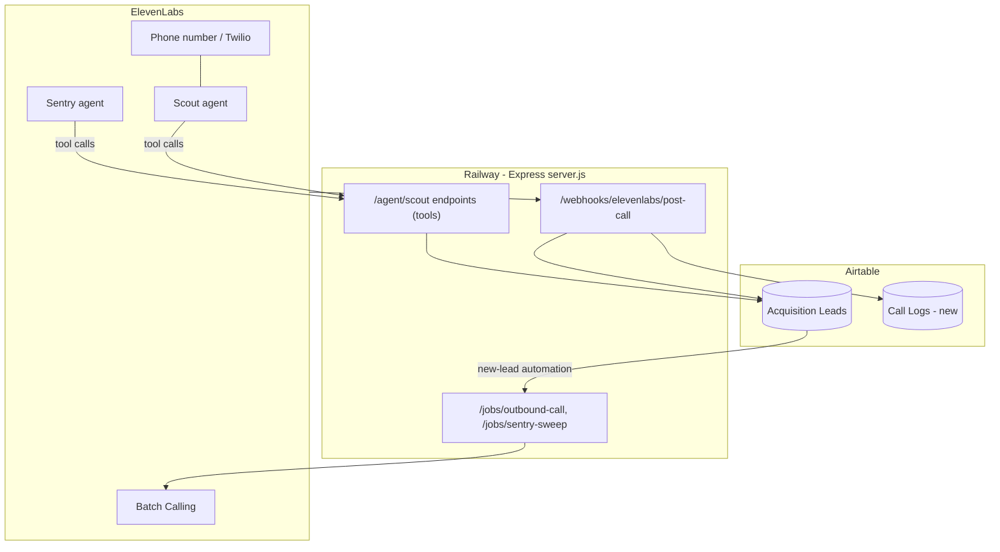

# Architecture & Integration

System map, the Airtable schema changes needed, and the Phase 0 repo fixes that everything else depends on. Back to [[00 - ElevenLabs Agents Overview]].

## Target architecture

## Current repo state (`ontiverosj/agents`)

- `server.js` — Express app: `GET /` health check, `POST /agent/scout` → `getLeadById`.
- `src/airtable.js` — Airtable client, table `Acquisition Leads`, `getLeadById` filters by `{ID}`.
- `src/index.js` — a Router listing Leads (~17 mapped fields); not currently served by anything.
- `railway.toml` — Railway deploy, `npm start`.

## Phase 0 — repo fixes (blockers)

| # | Bug | Fix |
|---|---|---|
| 1 | `package.json` `start` runs `src/index.js`, which exports a Router and never listens — Railway boots nothing | `"start": "node server.js"`; mount the router in `server.js` if its listing endpoint is wanted |
| 2 | `dotenv` and `airtable` used but not in `dependencies` — boot crash | `npm i dotenv airtable` |
| 3 | `src/index.js` hardcodes `'YOUR_BASE_ID'` and queries table `'Leads'` (vs `'Acquisition Leads'` in `src/airtable.js`) | Use env vars + the shared client in `src/airtable.js` |
| 4 | `getLeadById` returns `firstPage()`'s array; `if (!lead)` in `server.js` never 404s | Return `records[0] ?? null` |

## Airtable schema additions

**`Acquisition Leads` — new fields:**

| Field | Type |
|---|---|
| Last Called At | Date/time |
| Call Status | Single select: queued / completed / no-answer / voicemail / declined / unreachable |
| Seller Intent | Single select: selling_now / open / not_interested / unknown |
| Qualification Summary | Long text |
| Revenue Range | Single select or text |
| Timeline | Text |
| Reason for Selling | Long text |
| Next Step | Text |
| DNC | Checkbox |
| Pre-Call Brief | Long text (Scholar, later) |

**`Call Logs` — new table:**

| Field | Type |
|---|---|
| Lead | Link to Acquisition Leads |
| Conversation ID | Text (unique — idempotency key) |
| Agent | Single select: scout / sentry |
| Called At | Date/time |
| Duration (s) | Number |
| Outcome | Text |
| Transcript | Long text or URL |
| Recording URL | URL |
| Evaluation Results | Long text (JSON) |

## Design decisions

- **Keep the single Express server** — all tools, webhooks, and job triggers live in `server.js` routes. No new services until call volume demands it.
- **Airtable stays the source of truth.** ElevenLabs holds no state beyond agent configs; every call result lands in Airtable via [[02 - Agent - Scribe (Post-Call Notes)]].
- **Secrets only in Railway env vars** — see [[30 - Setup Checklist & Credentials]].
