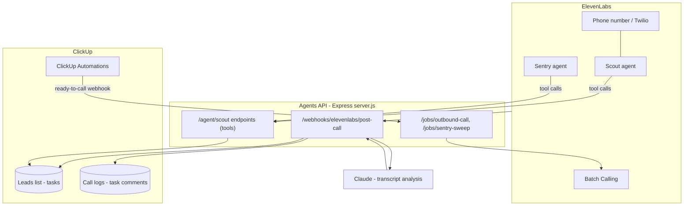

# Architecture & Integration

System map, the ClickUp custom fields needed, and how the code is laid out. Back to [[00 - ElevenLabs Agents Overview]].

## Target architecture

## Code layout (`ontiverosj/agents`)

- `server.js` — Express app: health check, Scout tool endpoints, post-call webhook, job triggers. Host-agnostic — runs anywhere Node runs.
- `src/clickup.js` — ClickUp API v2 client: lead lookup (`taskToLead`), custom-field updates **resolved by field name** (dropdowns resolve option IDs automatically), call-log comments, stale-lead queries. List ID and field names configured by env vars.
- `src/claude.js` — Claude client (`@anthropic-ai/sdk`): transcript → schema-validated qualification data on `claude-opus-5`, server-side refusal fallback enabled.
- `src/elevenlabs.js` — ElevenLabs client: webhook HMAC verification, single outbound calls, batch calling.
- `src/index.js` — leads listing router (mounted at `/leads`).

## ClickUp setup needed

**A leads list** — its ID goes in `CLICKUP_LEADS_LIST_ID` (open the list in ClickUp; the ID is in the URL). Each lead is a task; the **task ID is the `lead_id`** used everywhere.

**Custom fields on that list** (names configurable via env; defaults shown):

| Field | Type | Notes |
|---|---|---|
| Phone | Phone or text | Required for outbound calls |
| Business Name | Text | Falls back to the task name if absent |
| Owner Name | Text | |
| Industry | Text | |
| Seller Intent | Dropdown: selling_now / open / not_interested / unknown | Option names must match exactly |
| Call Status | Dropdown: queued / completed / no-answer / voicemail / declined / unreachable | |
| Last Called At | Date | |
| Revenue Range | Text (or dropdown) | |
| Timeline | Text | |
| Reason for Selling | Text | |
| Next Step | Text | |
| DNC | Checkbox | Excludes the lead from all calling |

Call logs need no extra list — each call lands as a **comment on the lead task** (conversation ID + Claude summary + transcript), so the full history reads inline in ClickUp.

**One Automation** (Phase 2): *status changes to "Ready to Call" → Call webhook → `POST /jobs/outbound-call`* with the bearer token header.

## Design decisions

- **ClickUp is the source of truth.** ElevenLabs holds no state beyond agent configs; every call result lands on the lead task via [[02 - Agent - Scribe (Post-Call Notes)]].
- **Claude does the reading.** Transcript → structured data extraction happens in one schema-constrained Claude call, so the fields in ClickUp are consistent enums, not free text.
- **One small Express server, host-agnostic.** All tools, webhooks, and job triggers are routes in `server.js`; deploy to any Node host (Render, Fly, a VPS, or ngrok while testing).
- **Secrets only in env vars** — see [[30 - Setup Checklist & Credentials]].
